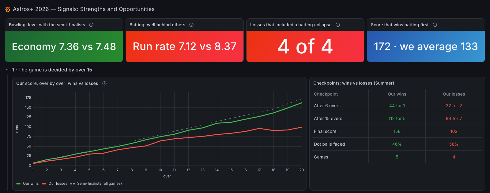
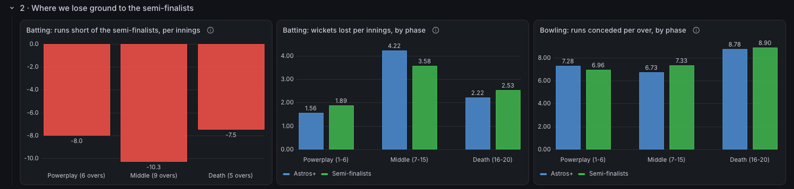
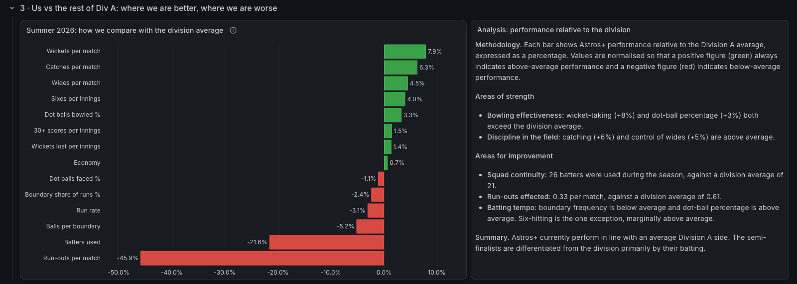
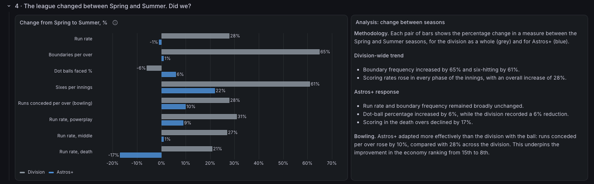
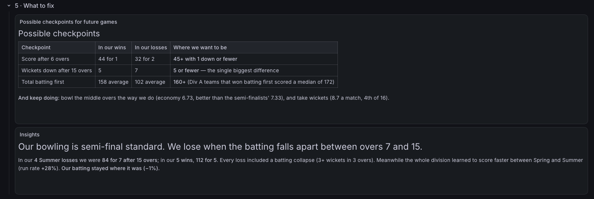
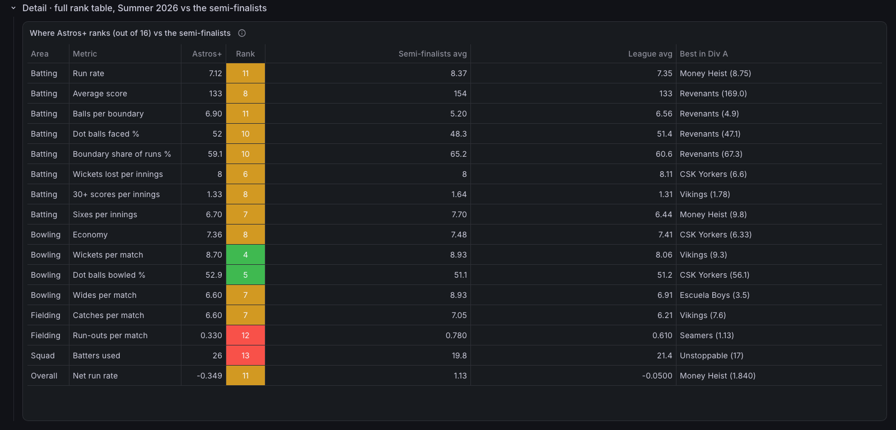
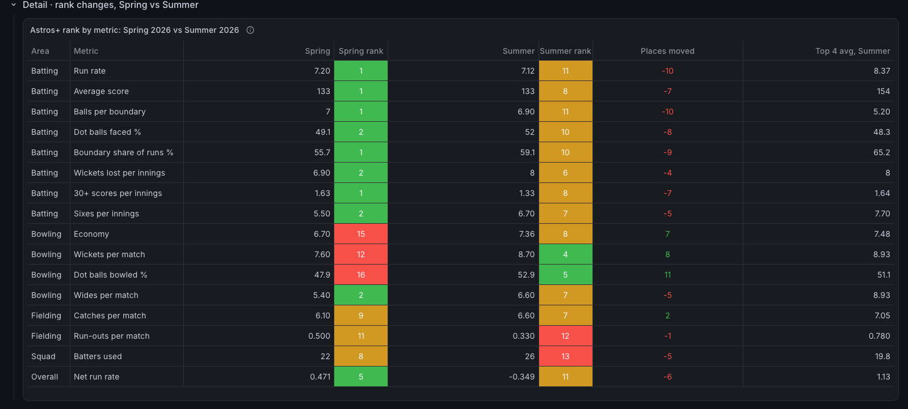

# Grafana Performance Observability

Sports team performance analytics, built the way a production observability stack is built: **extract → model in Postgres → visualise in Grafana**, with dashboards generated from code and a read-only data boundary between raw data and what the dashboard can see.

The pipeline is sport-agnostic in shape: ingest match events, model them as team-level signals, benchmark against the competition, and track how those signals change over time. **The first case study is amateur cricket.**

**Live dashboard (case study):** [Astros+ 2026 — Signals: Strengths and Opportunities](https://ardentsailboat1497.grafana.net/public-dashboards/6dfa470ce5304898a50712c39834bd14)



## The approach

| Observability idea | Applied to team performance |
|---|---|
| Signals, not raw logs | Per-match events modelled into team-level metrics (scoring rate, efficiency, failure points) |
| Baselines | Every metric compared with the league average and with the top 4 teams |
| Thresholds and incidents | Win/loss checkpoints, and detection of "collapse" events in a match |
| Trend over releases | Season-on-season change: how the league shifted, and whether the team adapted |
| Least-privilege access | The dashboard reads team-level views only; raw records stay behind a separate schema |

## Case study: Astros+ in NACL Division A (cricket, 2026)

134 matches across 2 seasons, 16 teams per season.

**Questions answered:**
- What separates wins from losses? (checkpoints after 6 overs, after 15 overs, final score)
- Where does the team lose ground to the semi-finalists, phase by phase?
- Where is the team above or below the league average?
- How did the league change between seasons, and did the team adapt?

**Headline findings:**
- Bowling is at semi-final standard (economy 7.36 vs 7.48).
- In the 4 Summer losses the team was 84 for 7 after 15 overs; in the 5 wins, 112 for 5. Every loss included a batting collapse.
- The league's scoring rate rose 28% between Spring and Summer; the team's stayed flat.

## Screenshots

**Where the gap to the top 4 teams opens up, phase by phase**


**Benchmarking against the league average**


**How the league shifted between seasons, and whether the team adapted**


**Checkpoints and insights**


<details>
<summary>Detail tables: full rank table and season-on-season rank changes</summary>




</details>

[Full-page view](docs/screenshots/00-full-dashboard.png)

## Architecture

```
Match data source ──► ingest/extract_*.js ──► data/*.json ──► ingest/load.py ──► Postgres (Neon)
 (CricClubs, behind     (slow, polite          (git-ignored)    (one transaction)       │
  Cloudflare)            browser extraction)                                             │  raw.*      record-level, owner only
                                                                                         │  cricket.*  team-level views
                                                                                         ▼
                              dashboards/build_*.py ──► dashboard JSON ──► Grafana Cloud ──► public link
                              (dashboards as code)                          (read-only role)
```

| Layer | Choice | Why |
|---|---|---|
| Extraction | Browser-side JavaScript | The source sits behind Cloudflare; a headless client is blocked |
| Storage | Neon serverless Postgres (free tier) | Scales to zero, never deleted for inactivity |
| Modelling | SQL views | Season-aware ranks, phase splits and incident detection, recomputed on every load |
| Access control | `grafana_reader` role, `SELECT` on team-level views only | Record-level data is unreachable from the dashboard |
| Visualisation | Grafana Cloud, built from Python | Reproducible; a dashboard change is a code change |

**Adapting to another sport:** replace the extractor and the `raw` schema with that sport's match events (e.g. possessions, sets, laps), then rewrite the team-level views. The loader, access model, baselines and dashboard builders carry over unchanged.

## Repository layout

```
db/
  01_schema.sql         raw tables: matches, innings, batting, bowling, overs
  02_views.sql          team-level views: team_summary, team_ranks, team_phase, collapses, ...
  DATA-QUALITY.md       reconciliation checks and known source discrepancies
ingest/
  extract_cricclubs.js  browser extraction script (cricket case study)
  load.py               full-refresh loader (schema + data + views in one transaction)
dashboards/
  build_story.py        the published dashboard
  build_astros_insights.py, build_season_compare.py, build_unified.py
                        earlier single-purpose dashboards, reused as panel libraries
data/                   raw match files (git-ignored: they contain player names)
```

## Running it

```bash
python3 -m venv .venv && .venv/bin/pip install -r requirements.txt

# .env (git-ignored)
#   DATABASE_URL=postgresql://<owner>:<password>@<host>/neondb?sslmode=require

.venv/bin/python ingest/load.py                                   # loads every data/*.json
cd dashboards && ../.venv/bin/python build_story.py <grafana-datasource-uid>
# then import dashboards/astros-story.json in Grafana (Dashboards → New → Import)
```

## Data and privacy

- Source: public league scorecards. Raw files are not committed.
- The published dashboard is team-level only. Player names stay in the `raw` schema, which the dashboard's database role cannot read.
- Reconciliation: innings totals match batting + extras in 267 of 268 innings; the exceptions are documented errors in the source data. See [`db/DATA-QUALITY.md`](db/DATA-QUALITY.md).
